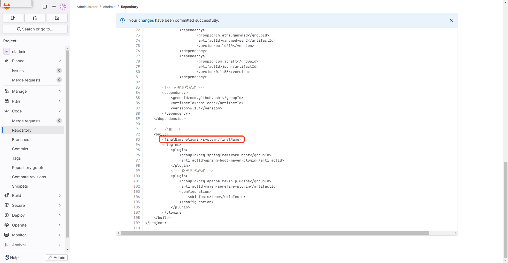
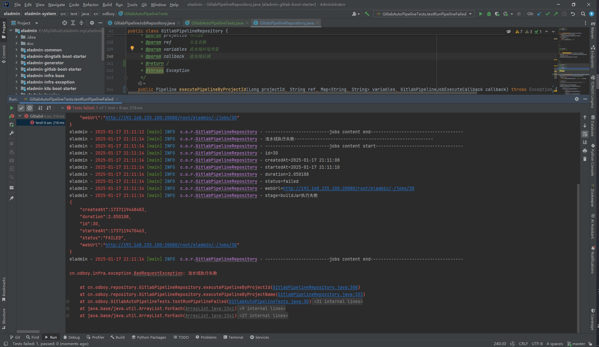
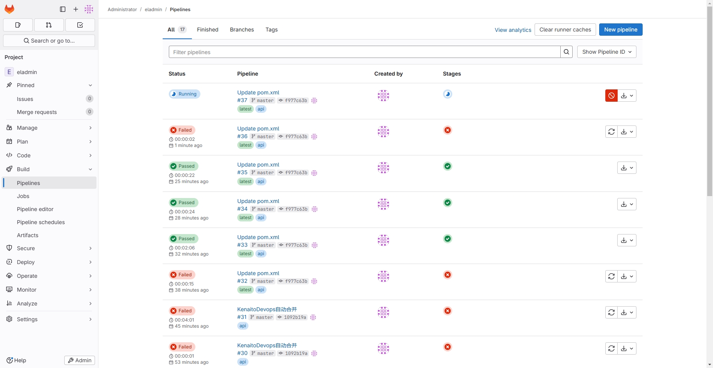

<h1 style="text-align: center">ELADMIN 后台管理系统</h1>

#### 项目简介

一个基于 Spring Boot 2.7.18 、 Mybatis-Plus、 JWT、Spring Security、Redis、Vue的前后端分离的后台管理系统

**开发文档：**  [https://eladmin.vip](https://eladmin.vip)

**体验地址：**  [https://eladmin.vip/demo](https://eladmin.vip/demo)

**账号密码：** `admin / 123456`

#### 项目源码

|        | 后端源码(eladmin)                               | 前端源码(eladmin-web)                           |
|--------|---------------------------------------------|---------------------------------------------|
| github | https://github.com/odboy-tianjun/eladmin-mp | https://github.com/odboy-tianjun/eladmin-mp |

#### 实验环境

> Window10 x64 12核 128G

| 虚拟系统    | 配置    | 平台     | 镜像/版本                                                   | 
|---------|-------|--------|---------------------------------------------------------|
| CentOS7 | 1核 4G | docker | registry.cn-hangzhou.aliyuncs.com/zhengqing/mysql:8.0   | 
| CentOS7 | 1核 4G | docker | registry.cn-hangzhou.aliyuncs.com/zhengqing/redis:7.0.5 |
| CentOS7 | 2核 6G | -      | GitLab Community Edition v17.7.0                        |
| CentOS7 | 2核 4G | -      | GitLab Runner v17.7.0，已配置安装Jdk11、Maven3.9.9             |
| CentOS7 | 6核 8G | -      | K8s v1.28.1，已配置安装Ingress V1.10.1、OpenKruise V1.6.4      |

#### 系统启动效率

| 模块             | 加入项目                                | 启动耗时(seconds) |
|----------------|-------------------------------------|---------------|
| eladmin-system | 无                                   | 9.19          |
| eladmin-system | 分布式quartz                           | 18.637        |
| eladmin-system | minio                               | 9.19          |
| eladmin-system | minio、dingtalk                      | 9.262         |
| eladmin-system | minio、dingtalk、gitlab               | 9.559         |
| eladmin-system | minio、dingtalk、gitlab、k8s           | 56.945        |
| eladmin-system | minio、dingtalk、gitlab、k8s、分布式quartz | 72.224        |

#### 主要特性

- 使用最新技术栈，社区资源丰富。
- 高效率开发，代码生成器可一键生成前后端代码
- 支持数据字典，可方便地对一些状态进行管理
- 支持接口限流，避免恶意请求导致服务层压力过大
- 支持接口级别的功能权限与数据权限，可自定义操作
- 自定义权限注解与匿名接口注解，可快速对接口拦截与放行
- 对一些常用地前端组件封装：表格数据请求、数据字典等
- 前后端统一异常拦截处理，统一输出异常，避免繁琐的判断
- 支持在线用户管理与服务器性能监控，支持限制单用户登录

#### 系统功能

- 用户管理：提供用户的相关配置，新增用户后，默认密码为123456
- 角色管理：对权限与菜单进行分配，可根据部门设置角色的数据权限
- 菜单管理：已实现菜单动态路由，后端可配置化，支持多级菜单
- 部门管理：可配置系统组织架构，树形表格展示
- 岗位管理：配置各个部门的职位
- 字典管理：可维护常用一些固定的数据，如：状态，性别等
- 系统日志：记录用户操作日志与异常日志，方便开发人员定位排错
- SQL监控：采用druid 监控数据库访问性能，默认用户名admin，密码123456
  ```text
    已删除，用默认Hikari连接池替代。
    原因是因为在生产环境，Init DruidDataSource方法，会导致应用hang住；
    还会导致获取不到/非常的慢获取连接池内的连接；
  ```
- 定时任务：整合Quartz做定时任务，加入任务日志，任务运行情况一目了然
- 代码生成：高灵活度生成前后端代码，减少大量重复的工作任务
- 邮件工具：配合富文本，发送html格式的邮件
- 七牛云存储：可同步七牛云存储的数据到系统，无需登录七牛云直接操作云数据
- 支付宝支付：整合了支付宝支付并且提供了测试账号，可自行测试
- 服务监控：监控服务器的负载情况

#### 项目结构

项目采用按功能分模块的开发方式，结构如下

- `eladmin-infra-base` 为系统的基础依赖模块
- `eladmin-infra-exception` 为系统的异常处理模块
- `eladmin-common` 为系统的公共模块，各种工具类，公共配置存在该模块
- `eladmin-system` 为系统核心模块也是项目入口模块，也是最终需要打包部署的模块
- `eladmin-logging` 为系统的日志模块，其他模块如果需要记录日志需要引入该模块
- `eladmin-tools` 为第三方工具模块，包含：邮件、七牛云存储、本地存储、支付宝
- `eladmin-generator` 为系统的代码生成模块，支持生成前后端CRUD代码
- `eladmin-gitlab-boot-starter` 为系统支持Gitlab功能的模块
- `eladmin-k8s-boot-starter` 为系统支持Kubernetes功能的模块
- `eladmin-dingtalk-boot-starter` 为系统支持Dingtalk功能的模块
- `eladmin-minio-boot-starter` 为系统支持Minio功能的模块

#### 详细结构

```
- eladmin-infra-base 基础模型、常量、工具类
- eladmin-infra-exception 全局异常处理模块
- eladmin-common 公共模块
    - base 提供了 Entity 基类
    - infra 基础设施层
        - cache redis配置
        - context 系统上下文
        - doc swagger配置
        - druid 数据源中间件配置
        - limit 接口限流切面
        - monitor 系统监控、健康检查等
        - mybatisplus mybatis-plus配置
        - security 安全类的系统自定义注解
        - upload 文件上传
    - util 系统通用工具类
- eladmin-logging 系统日志模块
- eladmin-tools 系统第三方工具模块
- eladmin-generator 系统代码生成模块
- eladmin-gitlab-boot-starter 支持管控Gitlab
    - constant 常量
    - contenxt 自动装配，连接初始化
    - model 模型
    - repository gitlab控制类
- eladmin-k8s-boot-starter 支持管控Kubernetes
    - constant 常量
    - contenxt 自动装配，连接初始化
    - model 模型
    - repository k8s控制类
    - util 工具/帮助类
- eladmin-dingtalk-boot-starter 支持管控Kubernetes
    - constant 常量
    - contenxt 自动装配，连接初始化
    - model 模型
    - repository dingtalk控制类
    - util 工具/帮助类
- eladmin-minio-boot-starter 支持管控Minio
    - constant 常量
    - contenxt 自动装配，连接初始化
    - model 模型
    - repository minio控制类
- eladmin-system 系统核心模块（系统启动入口）
    - infra 基础设施层
        - k8s k8s相关
        - server 配置跨域与静态资源，与数据权限
        - thread 线程池相关
        - websocket WebSocket相关
    - modules 系统相关模块(登录授权、系统监控、定时任务等)
```

#### Gitlab全自动化构建流程展示
> 感兴趣的可以参考我的博客进行环境的搭建 https://blog.odboy.cn/%E4%BB%8E%E9%9B%B6%E6%89%93%E9%80%A0%E8%BF%90%E7%BB%B4%E5%B9%B3%E5%8F%B0/









#### 特别鸣谢

- 感谢 [elunez](https://github.com/elunez) 大佬提供的前后分离基础框架
- 感谢 [zhy6599](https://gitee.com/zhy6599) 大佬提供的后端运维管理相关功能
- 感谢 [PanJiaChen](https://github.com/PanJiaChen/vue-element-admin) 大佬提供的前端模板
- 感谢 [Moxun](https://github.com/moxun1639) 大佬提供的前端 Curd 通用组件
- 感谢 [j.yao.SUSE](https://github.com/everhopingandwaiting) 大佬提供的匿名接口与Redis限流等功能
